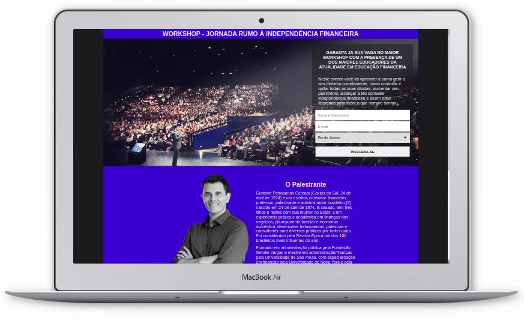

# Workshop - Landing Page

Neste projeto criei uma simples página de captura de leads para a venda de algum infoproduto.

O cliente poderá obter uma lista de leads para utilizar para divulgar os seus produtos e ofertas de seu negócio.

Estes contatos que forem obtidos através dessa página poderão ser implementados em alguma ferramenta de e-mail marketing, como por exemplo usando a plataforma <a href="https://mailchimp.com/">MailChimp</a>.

O site foi configurado para que se adapte da melhor forma possível em diversos tamanhos de telas.

# Tecnologias

  
  

# Preview

### Desktop

### Smartphone

Live demo: <a href="https://diegosouza007.github.io/LandingPage/">Landing Page</a>
